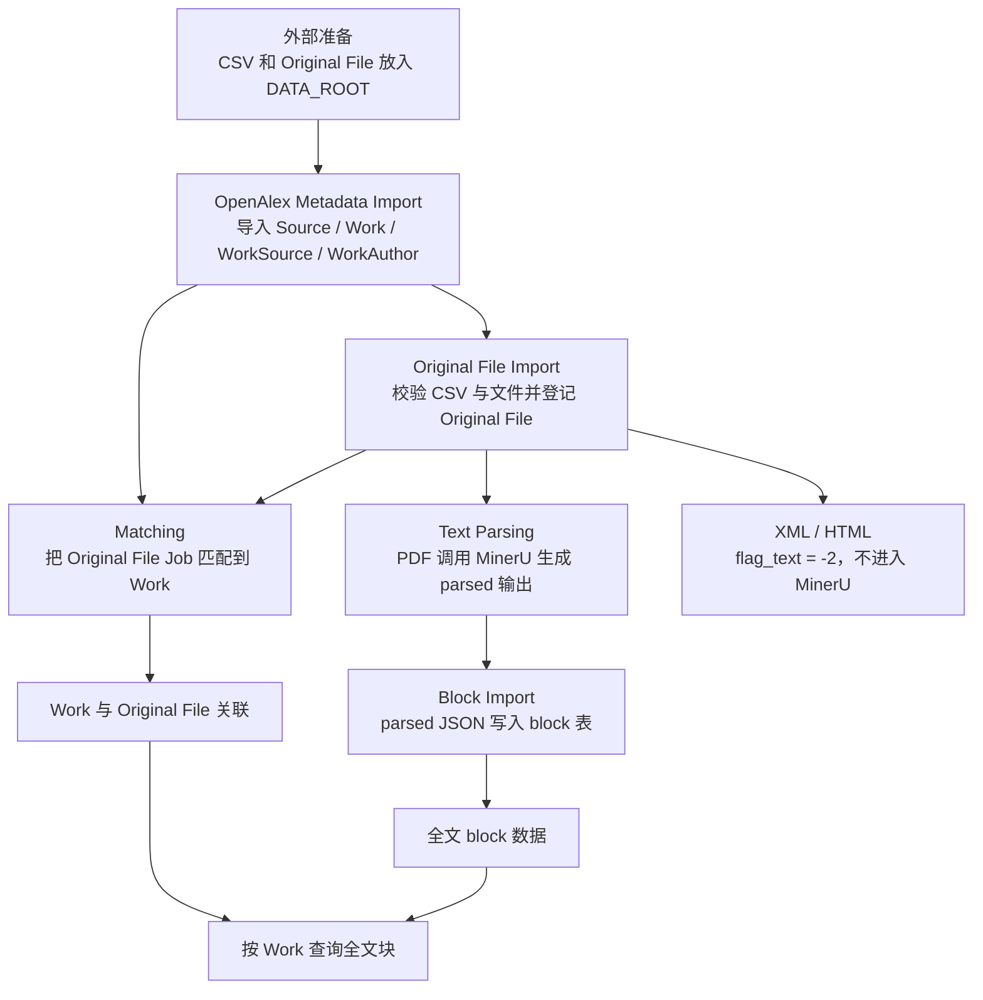

# Paperflow 全流程文档

本文说明当前版本的端到端处理流程、阶段职责和输入输出规范。术语以
`CONTEXT.md` 为准；数据库字段、约束和状态值以 `docs/db_design.md` 为准。

## 总览

Paperflow 是离线批处理管线。它是项目外的一个python项目，路径是/data/bak/code/paperflow。它不负责采集论文文件，只处理已经放到标准路径下的
OpenAlex 元数据、外部交付 CSV、Original File 和 MinerU parsed 输出。



当前实现状态：

| 阶段 | CLI | 状态 |
| --- | --- | --- |
| OpenAlex Metadata Import | `paperflow import-openalex` | 已实现 |
| Original File Import | `paperflow import-original-files` | 已实现 |
| Matching | `paperflow match` | 已实现 |
| Text Parsing | `paperflow parse-text` | 已实现 |
| Block Import | `paperflow import-blocks` | 已实现 |
| Run All | 无 | 不计划实现 |

## 全局规范

### 配置要求

- 使用 `uv` 运行命令。
- 运行前配置 OpenAlex 源数据库和 Paperflow 项目数据库。
- OpenAlex 源数据库只读；Paperflow 项目数据库读写。
- `DATA_ROOT` 是所有 CSV、Original File、MinerU 输出的物理根目录。
- 数据库中保存的文件路径都是相对 `DATA_ROOT` 的路径，不保存物理根路径，也不加
  `data/` 前缀。

### 标准相对路径

| 类型 | 相对路径 |
| --- | --- |
| CSV | `openalex/csv/{csv_file_name}` |
| Original File | `openalex/original/{source_id}/{original_file_name}` |
| MinerU raw 输出 | `openalex/mineru_raw/{source_id}/{file_id}/` |
| parsed 输出 | `openalex/parsed/{source_id}/{file_id}/` |

代码中路径模板由 `paperflow.domain.paths` 统一维护；不要在新代码或脚本里重复拼接。

### 状态字段

状态都记录在 `original_file_job`：

| 字段 | 取值 | 含义 |
| --- | --- | --- |
| `flag_match` | `0` | 未匹配 |
| `flag_match` | `1` | 已匹配，`matched_work_id` 必须非空 |
| `flag_match` | `-1` | 最近一次未匹配成功 |
| `flag_text` | `0` | 未解析 |
| `flag_text` | `1` | 解析中 |
| `flag_text` | `2` | 解析完成 |
| `flag_text` | `-1` | 解析失败，可用 `--retry-failed` 重试 |
| `flag_text` | `-2` | 当前文件类型不支持解析 |
| `flag_block` | `0` | block 未入库 |
| `flag_block` | `1` | block 入库完成 |
| `flag_block` | `-1` | block 入库失败，可用 `--retry-failed` 重试 |

## 阶段 0：外部准备

该阶段不属于 Paperflow 实现范围，但必须先完成。

### 要做的事

- 准备 OpenAlex 源数据库。
- 将外部采集得到的 CSV 放到 `DATA_ROOT/openalex/csv/`。
- 将外部采集得到的 Original File 放到
  `DATA_ROOT/openalex/original/{source_id}/`。
- 确认 CSV 中的 `source_id` 已计划导入 OpenAlex Metadata。

### 文件规范

CSV 必须使用 UTF-8，并包含以下列：

```text
source_id,year,paper_title,authors,doi,url,provider,file_name,file_path,file_type,file_size
```

字段要求：

| 字段 | 要求 |
| --- | --- |
| `source_id` | 必须是 Paperflow 项目库中已存在的 Source |
| `year` | 可空；非空时必须是整数 |
| `paper_title` | 可空 |
| `authors` | 可空；多作者用英文分号 `;` 分隔 |
| `doi` | 可空；导入时会归一化 |
| `url` | 可空 |
| `provider` | 可空；表示外部采集平台 |
| `file_name` | 必须等于 `file_path` 的文件名 |
| `file_path` | 必须以 `openalex/original/` 开头 |
| `file_type` | 只支持 `PDF`、`XML`、`HTML`，也允许写成带点后缀 |
| `file_size` | 必须等于磁盘文件字节数 |

## 阶段 1：OpenAlex Metadata Import

### 命令

```bash
uv run paperflow import-openalex --source-id S123 --year-from 2020 --year-to 2024
```

也可以用 source ID 文件：

```bash
uv run paperflow import-openalex --source-id-file source_ids.txt
```

source ID 文件每行一个 ID；空行和 `#` 开头的行会被忽略。

### 要做的事

- 校验所有传入的 `source_id` 都存在于 OpenAlex 源库。
- 从 OpenAlex 源库读取 Source、Work、Work-Source、Work-Author 数据。
- 写入 Paperflow 项目库。
- 对本次 Source 下 `flag_match=-1` 的 Original File Job 重置为 `0`。

### 输入规范

- 至少提供一个 `--source-id` 或 `--source-id-file`。
- `--year-from` 和 `--year-to` 可选；同时提供时 `year_from <= year_to`。
- 任意一个 `source_id` 不存在时，整批失败。

### 输出规范

写入或更新：

- `source`
- `work`
- `work_source`
- `work_author`

不创建 Original File，也不创建 Original File Job。

## 阶段 2：Original File Import

### 命令

```bash
uv run paperflow import-original-files --csv openalex/csv/batch.csv
```

可临时覆盖数据根目录：

```bash
uv run paperflow import-original-files --csv openalex/csv/batch.csv --data-root /path/to/data
```

### 要做的事

- 读取 CSV。
- 校验 CSV 列、文件路径、文件名、文件类型、文件存在性和文件大小。
- 校验 `source_id` 已在 Paperflow 项目库中存在。
- 按 File Hash 登记或更新 `original_file`。
- 为缺失的 Original File 创建 `original_file_job`。

### 输入规范

- `--csv` 是相对 `DATA_ROOT` 的路径。
- CSV 文件必须位于 `openalex/csv/` 约定目录下。
- Original File 必须已经存在；Paperflow 不移动、不复制外部文件。
- `file_id` 为规范化 `source_id`、`year`、`paper_title` 与 `authors` 的 SHA-256 十六进制哈希；`file_name` 去扩展名必须等于该值。
- 同一 File Hash 重复导入时保留一条 Original File Record。
- 文件类型优先级为 `PDF > XML > HTML`；更高优先级会替换文件名、路径、类型和大小。

### 输出规范

写入或更新：

- `original_file`
- `original_file_job`

新 Job 初始状态：

- `flag_match=0`
- `matched_work_id=NULL`
- PDF：`flag_text=0`
- XML / HTML：`flag_text=-2`
- `flag_block=0`

无效 CSV 行、未知 Source、文件校验失败行会被跳过。

## 阶段 3：Matching

### 命令

```bash
uv run paperflow match
```

可限定范围：

```bash
uv run paperflow match --source-id S123
uv run paperflow match --work-id W456
```

### 要做的事

- 扫描 `flag_match=0` 的 Original File Job。
- 在同一 Source 范围内匹配 Work。
- 更新 `original_file_job.flag_match` 和 `matched_work_id`。

### 匹配规则

匹配顺序：

1. Direct Work Match：`file_id` 等于已导入且属于同一 Source 的 `work_id`。
2. DOI Match：CSV DOI 与 Work DOI 相同，并且候选唯一。
3. Metadata Match：用标题、作者、年份打分，并要求最高分超过阈值且拉开次高分。

Metadata 默认权重：

| 项 | 默认值 |
| --- | --- |
| 标题 | `0.6` |
| 作者 | `0.25` |
| 年份 | `0.15` |
| 匹配阈值 | `0.8` |
| 与次高分差距 | `0.05` |

这些值由 `Settings` 中的 `MATCH_*` 配置控制。

### 输出规范

- 匹配成功：`flag_match=1`，`matched_work_id` 非空。
- 匹配失败：`flag_match=-1`，`matched_work_id=NULL`。
- `--work-id` 过滤时，不匹配目标 Work 的文件只计入 skipped，不标记失败。
- 一个 Work 最多被一个 Original File Job 匹配。

## 阶段 4：Text Parsing

### 命令

```bash
uv run paperflow parse-text
```

可限定范围或重试失败任务：

```bash
uv run paperflow parse-text --source-id S123
uv run paperflow parse-text --file-id abc123
uv run paperflow parse-text --limit 10
uv run paperflow parse-text --retry-failed
uv run paperflow parse-text --concurrency 4
```

### 要做的事

- 调用已运行的 MinerU router `/tasks` 异步接口。
- 解析 PDF Original File。
- 按 `--concurrency` 同时保持多个 router 任务在途。
- 解压 MinerU ZIP 到 raw 目录。
- 规范化 JSON、MD 和 images 到 parsed 目录。
- 登记 parsed JSON 和 MD 到 `text_file`。

### 输入规范

- 只处理 `original_file_type='PDF'`。
- 默认只处理 `flag_text=0`；加 `--retry-failed` 后也处理 `flag_text=-1`。
- Text Parsing 不依赖 Matching 状态；未匹配的 PDF 也可以解析。
- `--limit` 必须大于 0。
- 任务在 Paperflow 数据库中原子领取并设置 `flag_text=1`；多个
  `parse-text` worker 并发运行时不会领取同一行。
- MinerU router 必须已经通过 `/root/servers/mineru-pdf/run_mineru_router.sh`
  运行；Paperflow 不启动 MinerU 进程。

MinerU 输出要求：

- ZIP 内必须能找到 `{original_file_stem}_content_list.json` 或
  `{original_file_stem}_content_list_v2.json`。
- 同时存在时优先使用 `content_list`。
- ZIP 内必须能找到 `{original_file_stem}.md`。
- 若存在 `images/` 目录，会复制到 parsed 输出目录。

### 路径与格式规范

Raw 输出目录：

```text
openalex/mineru_raw/{source_id}/{file_id}/
```

Parsed 输出目录：

```text
openalex/parsed/{source_id}/{file_id}/
```

Parsed 文件名：

```text
{file_id}.json
{file_id}.md
images/
```

重跑同一 `file_id` 前会替换 raw、parsed 和旧 `text_file` 记录。

### 输出规范

- 成功：`flag_text=2`，`flag_block=0`。
- 失败：`flag_text=-1`。
- 写入 `text_file(file_id, file_type, file_name, file_path, file_size)`。
- `text_file.file_type` 只登记 `JSON` 和 `MD`。

## 阶段 5：Block Import

### 命令

```bash
uv run paperflow import-blocks
```

可限定范围或重试失败任务：

```bash
uv run paperflow import-blocks --source-id S123
uv run paperflow import-blocks --file-id abc123
uv run paperflow import-blocks --limit 10
uv run paperflow import-blocks --retry-failed
```

### 要做的事

- 扫描已完成 Text Parsing 的 Original File Job。
- 读取 `text_file` 登记的 parsed JSON。
- 将 MinerU `content_list` 映射到 block 主表和扩展表。
- 按 `file_id` 幂等重建 block 数据。

### 输入规范

- 只处理 `flag_text=2`。
- 默认只处理 `flag_block=0`；加 `--retry-failed` 后也处理 `flag_block=-1`。
- `--limit` 必须大于 0。
- 只读取 `text_file.file_type='JSON'`；MD 不作为 Block Import 输入。
- parsed JSON 可以是数组，也可以是包含 `content`、`content_list`、`items` 或
  `blocks` 数组的对象。
- content item 必须是对象。

### Block 类型规范

写入 `block.block_type` 的类型：

```text
title, text, equation, table, image, reference, page_footnote, discarded
```

当前映射会把 MinerU 原始类型归一化：

| MinerU 原始类型特征 | block 类型 |
| --- | --- |
| header、page header、页码、aside | `discarded` |
| title 或有 `text_level` | `title` |
| equation / formula | `equation` |
| table | `table` |
| image / figure / chart | `image` |
| page_footnote | `page_footnote`，同时写 `block_footnote` |
| ref_text | `reference`，同时写 `block_reference` |
| list 且 sub_type=ref_text | `reference`，同时写 `block_reference` |
| 其他 list | `text` |
| 其他 | `text` |

### 输出规范

写入或重建：

- `block`
- `block_image`
- `block_table`
- `block_equation`
- `block_footnote`
- `block_reference`

规则：

- `block_id` 由 `file_id` 和块顺序稳定生成。
- `block_seq` 在同一 `file_id` 内从 0 开始。
- 标题层级写入 `title_level`。
- 非标题块的 `parent_title_block_id` 指向最近的上级标题块。
- 成功后 `flag_block=1`。
- 失败后 `flag_block=-1`。
- 重复导入同一 `file_id` 会先删除旧 block 及扩展表记录，再写入新结果。

## 运行顺序建议

当前没有也不计划提供 `run-all` 命令。按下面顺序手动运行：

```bash
uv run paperflow import-openalex --source-id S123
uv run paperflow import-original-files --csv openalex/csv/batch.csv
uv run paperflow match --source-id S123
uv run paperflow parse-text --source-id S123
uv run paperflow import-blocks --source-id S123
```

Matching 和 Text Parsing 都依赖 Original File Import 产生的 Original File Job；
Text Parsing 不依赖 Matching 成功。Block Import 只依赖 Text Parsing 成功。

显式运行阶段是当前支持的调度方式。不要用一层 CLI wrapper 隐藏 CSV 输入、
过滤条件、重试策略和 MinerU 依赖；只有引入持久化 batch/run 状态和恢复语义
时才重新考虑 `run-all`。

## 失败与重试

- OpenAlex Metadata Import 失败时整批失败，不写入部分无效 Source。
- Original File Import 逐行跳过无效记录，继续处理其他行。
- Matching 失败会把 Job 标记为 `flag_match=-1`；后续 OpenAlex Metadata Import
  会把受影响 Source 的失败匹配重置为 `0`。
- Text Parsing 失败会把 Job 标记为 `flag_text=-1`；需要 `parse-text --retry-failed`
  才会重试。
- Block Import 失败会把 Job 标记为 `flag_block=-1`；需要
  `import-blocks --retry-failed` 才会重试。

## 查询关系

常见下游查询路径：

```text
work.work_id
  -> original_file_job.matched_work_id
  -> original_file_job.file_id
  -> block.file_id
```

如果只需要文件级处理状态，以 `original_file_job.file_id` 为中心查询 Matching、Text
Parsing 和 Block Import 状态。
